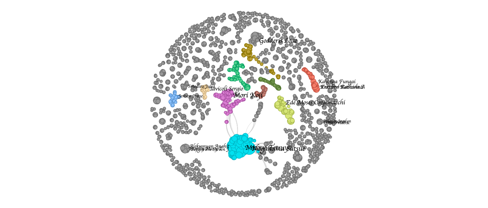

# Example - Author co-occurrence analysis
This example retrieves articles from PubMed and uses the author information to construct a nodes and edges list that can be used for an author co-occurrence analysis (e.g. with a tool like Gephi). A nodes list is created by taking every unique author found in the result set, and the edges list is created by creating a list of all unique combinations of authors. The combinations of authors is also counted so that there is a "weight" column available that indicates the number of times these authors co-occurred. The CSV files produced by this script can be loaded directly into Gephi for further processing.

## Why?
Analyzing all the literature in a field can be a very complicated task. First steps could be to visualize the entire field in a graph. One of these visualizations is the author co-occurrence graph, that shows how authors are inter-connected. The graph helps to answer questions like: What authors connect multiple research groups together?

## Example - Field of occupational health
Here we showcase a visual representation of the field of occupational health:


```python
!pip install networkx ipysigma
```


```python
import itertools

from pymed import PubMed

import networkx as nx
from ipysigma import Sigma


# Create a PubMed object that GraphQL can use to query
# Note that the parameters are not required but kindly requested by PubMed Central
# https://www.ncbi.nlm.nih.gov/pmc/tools/developers/
pubmed = PubMed(tool="Author co-occurence analysis", email="my@email.address")

# Create a GraphQL query in plain text
QUERY = "occupational health[Title]"


# Execute the query against the API
results = list(pubmed.query(QUERY, max_results=1344))

# Create an edge for each combination of authors (co-authorship)
edges = list(
    itertools.chain.from_iterable(
        [
            [combination for combination in itertools.combinations(co_author_list, 2)]
            for co_author_list in [
                [
                    f'{author["lastname"]} {author["firstname"]}'
                    for author in article.authors
                ]
                for article in results
            ]
        ]
    )
)

# Create a networkx graph
G = nx.Graph()
G.add_edges_from([(edge[0], edge[1], {"weight": edges.count(edge)}) for edge in edges])

# Create a Sigma graph
Sigma(
    G, 
    node_size=G.degree,
    default_edge_type="curve",
    node_border_color_from="node",
    node_label_size=G.degree,
    label_font="cursive",
    node_metrics={"community": "louvain"},
    node_color="community",
    label_density=3
)
```



